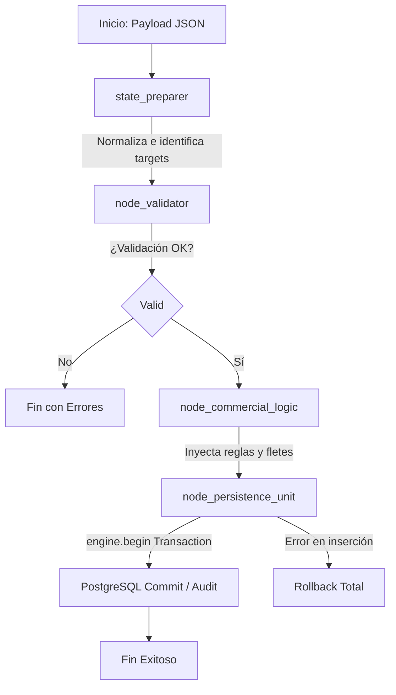

# Especificación Técnica y Plan de Implementación: Optimización Operativa
**Proyecto:** BASA Argentina (Banco de Archivos S.A.)  
**Fecha:** 2026-06-26  
**Documento:** Análisis de Casos de Uso e Integración Agéntica

---

## 1. Resumen Ejecutivo y Enfoque del Proyecto

El objetivo de esta iniciativa es acelerar el desarrollo del motor transaccional de **BASA Argentina** para cinco casos de uso críticos identificados en la etapa de Discovery. Como base metodológica y de diseño, tomamos el éxito del **ABM Agéntico de Clientes**, el cual funciona como un motor interno modularizado en forma de **grafo de estado** (orquestador de agentes) que garantiza transacciones atómicas, validaciones estrictas en base de datos y trazabilidad total.

Para acelerar el despliegue y mostrar avances tangibles a los directivos y clientes, la estrategia consiste en **levantar primero las interfaces visuales (Mockups / Frontends)** correspondientes a cada caso de uso en la plataforma cliente (ASP Web) y la consola de operarios (Aconcagua), definiendo con total precisión qué datos recolectan, cómo se validan y cómo se integran al orquestador backend "invisible" que opera sobre la base de datos PostgreSQL.

---

## 2. El Modelo Base: Arquitectura del Orquestador Agéntico

Los nuevos desarrollos se integrarán en el flujo de ejecución por nodos definido para el ABM de Clientes. Cada requerimiento pasará de forma secuencial a través de un estado compartido (`GraphState` / `AbmState`):

### Roles de los Nodos del Grafo para los Nuevos Casos de Uso:
1. **`state_preparer`**: Recibe el payload JSON del frontend (ASP Web o Aconcagua), detecta el `requerimiento_tipo_id` y define las tablas afectadas (`dbo.requerimiento`, `dbo.elemento`, etc.).
2. **`node_validator`**: Aplica reglas de negocio y restricciones físicas (formato de códigos de barra, estados permitidos, disponibilidad del elemento). Si falla, corta el flujo devolviendo un array de errores estructurados.
3. **`node_commercial_logic`**: Calcula costos adicionales (cargos de flete si exceden los 20 elementos, tarifas de archivistas, etc.).
4. **`node_persistence_unit`**: Abre una transacción única (`engine.begin()`). Ejecuta los inserts/updates en múltiples tablas y la tabla `dbo.movimiento`. Si ocurre un fallo en cualquier punto de la base de datos, aborta la transacción mediante rollback automático para evitar datos corruptos.

---

## 3. Análisis Detallado de los 5 Casos de Uso Priorizados

---

### Caso de Uso 1: Ordenamiento y Ubicación de Cajas en Planta

* **Descripción:** Control físico y registro espacial en el galpón para eliminar la problemática histórica de pérdida física ("extravío") de cajas.
* **Plazo / SLA:** Inmediato (Prioridad Crítica de Planta).

#### A. Reglas de Negocio y Restricciones
* Una posición en estantería (`dbo.posicion`) solo puede albergar una caja a la vez (relación de exclusión 1-a-1 en base de datos).
* Los códigos de barra de las posiciones siguen el formato de nomenclatura de planta (`codigoBarra` en `dbo.modulos` de 14 dígitos).
* El estado de la posición debe actualizarse a `'OCUPADO'` cuando se le asigne un elemento, y volver a `'DISPONIBLE'` si el elemento es retirado.

#### B. Flujo de Trabajo Operativo (Paso a Paso)
1. El operario descarga/recibe las cajas físicas en la zona de clasificación de planta.
2. Utilizando un colector de datos laser (Memo Collector), el operario escanea el código de barra de la caja física (`dbo.elemento.codigo`).
3. Acto seguido, escanea el código de barra de la ubicación física en la estantería (etiqueta del módulo/bloque).
4. El colector genera un archivo plano (.txt) que se descarga y procesa en la carpeta de ingesta.
5. El sistema procesa la asignación vinculando el ID de la caja al ID de la ubicación en planta.

#### C. Mapeo de Tablas y Esquema de Base de Datos
* **`dbo.posicion`**: Controla el estado del espacio físico.
  * `id` (bigint, PK)
  * `estado` (varchar(50), default `'DISPONIBLE'`)
  * `estanteria` (numeric(18,0))
  * `codigo_modulo` (varchar(12))
* **`dbo.elemento`**: Representa la caja física.
  * `id` (bigint, PK)
  * `codigo` (varchar(100)) — Código de barra de la caja.
  * `posicion_id` (bigint, FK -> `dbo.posicion.id`) — Almacena la relación de ubicación.
* **`dbo.modulos`**: Estructura de coordenadas físicas.
  * `estante_id` (numeric, FK -> `dbo.estanterias.id`)
  * `codigoBarra` (varchar(14))

#### D. Especificaciones de la Interfaz Visual (Mockup Requerido)
* **Pantalla de Planta (Aconcagua - Módulo Ubicaciones):**
  * Campo de entrada de escaneo rápido: "Escanear Caja" (autofoco).
  * Campo de entrada de escaneo rápido: "Escanear Posición" (autofoco sucesivo).
  * Grid de confirmación: Muestra una tarjeta visual por cada emparejamiento con indicador de estado (Verde = Vinculado OK, Rojo = Posición ya Ocupada o Caja no existente).
  * Botón de confirmación masiva de ubicaciones cargadas.

#### E. Lógica del Orquestador Backend
* **`node_validator`**:
  * Verifica si la caja (`dbo.elemento.codigo`) existe en el sistema.
  * Verifica si la posición (`dbo.posicion.id`) existe y está en estado `'DISPONIBLE'`.
* **`node_persistence_unit`**:
  * Actualiza `dbo.elemento.posicion_id` con el ID de la posición.
  * Modifica `dbo.posicion.estado` a `'OCUPADO'`.
  * Inserta auditoría en `dbo.movimiento` con `tipo_movimiento = 'UBICACION_FISICA'`.

---

### Caso de Uso 2: Consulta Normal de Caja

* **Descripción:** Solicitud diaria de cajas físicas por parte del cliente para su consulta temporal y posterior devolución.
* **Plazo / SLA:** 48 Horas.

#### A. Reglas de Negocio y Restricciones
* La caja solicitada debe tener un estado de `'en guarda'` (en almacenamiento).
* Si el estado es `'en consulta'` o `'en transito'`, el sistema debe rechazar la solicitud e informar al usuario en tiempo real.
* **Formato Estricto de Cajas (Prefijo de 12 dígitos):**
  * Cajas de 7 dígitos: Anteponer prefijo `11000` (ej: `110001234567`).
  * Cajas de 6 dígitos: Anteponer prefijo `110000` (ej: `110000123456`).
  * Cajas de 4 dígitos (Viejas): Prefijo `13` + código del cliente a 4 caracteres (ej: `1025`) + `00` + número de caja (ej: `131025001234`).

#### B. Flujo de Trabajo Operativo y Ciclo de Vida
1. **Creación:** El cliente genera el pedido en la web (ASP Web), completando la dirección y agregando los códigos de barra de las cajas con sus validaciones de prefijo.
2. **Asignación:** En planta (Aconcagua), la tarea de picking es asignada a un operario asignando estado inicial.
3. **Picking (Control 1):** El operario busca la caja en el módulo y escanea su etiqueta.
   * *Excepción:* Si la caja contiene elementos individuales catalogados internamente, el sistema lanza una alerta amarilla: un supervisor debe autorizar y cambiar el estado de los elementos internos a `'en transito'` o `'en salida'` antes de permitir la impresión del remito.
4. **Remito:** Se imprime el remito físico. Se permite ingresar observaciones personalizadas.
5. **Ruta (Control 2):** Las cajas se asocian a una Hoja de Ruta (`dbo.hoja_ruta`) y se realiza un segundo escaneo físico antes de subir el lote al transporte.
6. **Entrega:** El transportista entrega las cajas en la dirección del cliente, quien firma el remito físico.
7. **Cierre:** Al regresar a la planta, el remito firmado se escanea, se indexa mediante lote de digitalización y se ejecuta el proceso del demonio del sistema para pasar el requerimiento al estado `'FINALIZADO'`.

#### C. Mapeo de Tablas y Esquema de Base de Datos
* **`dbo.requerimiento`**: Registra la solicitud del cliente.
  * `id` (bigint, PK)
  * `requerimiento_tipo_id` (bigint, FK -> `requerimiento_tipo.id` — Para este caso es el código `04`)
  * `estado` (varchar(50), ej: `'PENDIENTE'`, `'INICIADO'`, `'EN RUTA'`, `'ENTREGADO'`, `'FINALIZADO'`)
  * `direccion_entrega_id` (bigint, FK -> `dbo.direccion.id`)
* **`dbo.elemento`**: Almacena el contenedor (caja) y su estado operacional.
  * `id` (bigint, PK)
  * `codigo` (varchar(100))
  * `estado` (varchar(50), ej: `'en guarda'`, `'en consulta'`, `'en transito'`, `'en cliente'`)
* **`dbo.hoja_ruta`** & **`dbo.hoja_ruta_detalle`**: Asocian el transporte y los pedidos de la jornada.

#### D. Especificaciones de la Interfaz Visual (Mockup Requerido)
* **Pantalla Cliente (ASP Web - Pedido de Caja):**
  * Selector dropdown de direcciones de entrega preestablecidas.
  * Campo de entrada inteligente con máscara de validación automática para forzar el prefijo de 12 dígitos según la longitud del código de caja ingresado.
  * Grilla de carga temporal con botón "Eliminar".
  * Validador visual inmediato que colorea de rojo las cajas en estado no disponible ('en consulta') mostrando alerta de error.
* **Pantalla Operador (Aconcagua - Procesamiento de Picking):**
  * Dashboard guiado por iconos secuenciales que cambian según el estado (Asignar Operario -> Leer Etiquetas [Verde/Rojo] -> Generar Remito -> Imprimir Hoja de Ruta -> Digitalizar).
  * Banner de Alerta Amarilla destacado si existen unidades internas sin autorizar.

#### E. Lógica del Orquestador Backend
* **`node_validator`**:
  * Valida que las cajas cumplan con la lógica de prefijos según sus caracteres.
  * Consulta si el elemento existe y si su `estado = 'en guarda'`. De lo contrario, inserta el error.
* **`node_persistence_unit`**:
  * Crea el registro en `dbo.requerimiento` e inserta los elementos en detalle del requerimiento.
  * Registra la salida en `dbo.movimiento` actualizando el estado de la caja de `'en guarda'` a `'en transito'`.

---

### Caso de Uso 3: Consulta Normal de Legajos

* **Descripción:** Pedido diario de archivos o carpetas (legajos) contenidos dentro de cajas.
* **Plazo / SLA:** 48 Horas (Urgente: 6 Horas).

#### A. Reglas de Negocio y Restricciones
* El legajo solicitado debe existir en la tabla de referencias indexadas (`dbo.referencia`) y tener estado `'en guarda'`.
* **Formato Estricto de Legajos (12 dígitos):**
  * Legajos de 7 dígitos: Prefijo `12000` (ej: `120001234567`).
  * Legajos de 6 dígitos: Prefijo `120000` (ej: `120000123456`).
  * Legajos viejos: Prefijo `14` + código de cliente a 4 caracteres + `00` + número de legajo (ej: `141025001234`).
* **Regla de Splitting Automático (Crítica):** Si el operario al realizar el picking no localiza físicamente uno o más de los legajos solicitados (pueden faltar en la caja contenedora), el sistema no frena el pedido. Se despachan los legajos encontrados y, al procesar el remito, **el sistema genera automáticamente un nuevo requerimiento hijo** conteniendo exclusivamente los legajos faltantes para auditoría y búsqueda posterior.

#### B. Flujo de Trabajo Operativo y Ciclo de Vida
1. El cliente solicita los códigos de barra de legajo específicos vía ASP Web.
2. En Aconcagua se asigna la tarea al picking de planta.
3. El operario abre la caja contenedora especificada por el sistema para retirar los legajos.
4. Escanea los códigos del legajo.
   * Si se leen correctamente, se marcan en verde en la pantalla de control.
   * Si falta alguno, se deja en blanco. El sistema avisa y genera el splitting al autorizar la salida.
5. Emisión de Remito y Hoja de Ruta.
6. Transporte, control en cliente y entrega física.
7. Escaneo del remito conformado, procesamiento por demonio de digitalización e indexación en base de datos para finalización del ciclo.

#### C. Mapeo de Tablas y Esquema de Base de Datos
* **`dbo.referencia`**: Tabla clave que vincula el legajo a la caja y guarda metadatos.
  * `id` (bigint, PK)
  * `elemento_contenedor_id` (bigint, FK -> `dbo.elemento.id` — La caja que lo contiene)
  * `texto1`, `texto2` (campos de búsqueda del legajo: apellido, nombre, tipo de legajo)
  * `numero1` (DNI u otra clave numérica de indexación)
* **`dbo.requerimiento`**: Relaciona el tipo de requerimiento (`requerimiento_tipo_id = 02` para consulta normal de legajo).

#### D. Especificaciones de la Interfaz Visual (Mockup Requerido)
* **Pantalla de Picking de Legajos (Aconcagua):**
  * Sección central con el listado de legajos solicitados.
  * Cuadro de lectura de código de barras.
  * Feedback visual inmediato: Los leídos pasan a color verde a la izquierda. Los pendientes permanecen en gris.
  * Panel derecho: "Elementos No Encontrados (Splitting)". Muestra alertas de aquellos ítems que se declararán como faltantes y generarán el pedido residual automático al procesar.

#### E. Lógica del Orquestador Backend
* **`node_validator`**:
  * Verifica prefijos del legajo.
  * Controla que el legajo referenciado no esté en estado `'en consulta'` o `'de baja'`.
* **`node_persistence_unit`**:
  * Si hay splitting, ejecuta una operación transaccional atómica:
    1. Actualiza el requerimiento original reduciendo la cantidad a los elementos físicamente encontrados y leídos.
    2. Crea un nuevo requerimiento con estado `'PENDIENTE_BUSQUEDA'` para los elementos no encontrados.
    3. Registra el movimiento individual de cada legajo encontrado como `'en transito'`.
    4. Garantiza que todo esto ocurra dentro del bloque `engine.begin()`; si la base de datos rechaza la creación del pedido hijo, revierte los cambios de estado para evitar la pérdida de trazabilidad de los legajos.

---

### Caso de Uso 4: Retiros por Cantidad o Referencia

* **Descripción:** Proceso de retiro físico de cajas/legajos desde las oficinas del cliente para su resguardo e ingreso a la planta de BASA.
* **Plazo / SLA:** 48 Horas.

#### A. Reglas de Negocio y Restricciones
* **Límite de Flete Comercial:** Un solo flete cubre un máximo de 20 elementos (sean cajas o legajos). Si el cliente solicita retirar 21 o más elementos en un pedido, el orquestador backend de facturación incrementa automáticamente el valor del campo `dbo.requerimiento.fletes` (+1 por cada lote adicional de 20 o fracción).
* **Retiro por Cantidad:** El cliente solicita un número genérico de cajas vacías o a retirar. No es necesario especificar los códigos de barra previamente en el sistema.
* **Retiro por Referencia:** Obligatorio para clientes estrictos (ej. Banco Supervielle). Los elementos deben estar creados y parametrizados previamente en base de datos. Las lecturas físicas de los códigos de barra durante el retiro deben coincidir exactamente con el listado cargado en el requerimiento.

#### B. Flujo de Trabajo Operativo y Ciclo de Vida
1. **Solicitud:** El cliente programa el retiro vía ASP Web.
2. **Despacho:** El transportista viaja a las oficinas del cliente llevando un remito impreso.
3. **Retiro y Escaneo en Cliente (Nomenclatura Remito):** El chofer retira las cajas y las escanea en el cliente con el colector generando una lectura.
   * *Nomenclatura obligatoria del archivo de lectura:* `0002-000[numero_remito]-[numero_requerimiento]`.
4. **Ingreso a Planta (Nomenclatura Ingreso):** Las cajas llegan al sector de descarga de planta. Un operario realiza un escaneo global de recepción.
   * *Nomenclatura obligatoria:* `0001-[fecha]-[provincia]` (ej: `0001-26062026-MZA`).
5. **Procesamiento de Conciliación:** El operador de planta ingresa el remito en el sistema para realizar la comparación física de cantidades.
   * Si las cantidades coinciden (ej. se pidieron 15 y llegaron 15), se procesa directo.
   * Si se retiraron menos (ej. 11 de 15), el sistema detecta la discrepancia, advierte al usuario, reduce la cantidad a facturar y finaliza el circuito enviando un email automatizado al cliente con el desglose físico.

#### C. Mapeo de Tablas y Esquema de Base de Datos
* **`dbo.requerimiento`**:
  * `cantidad` (numeric — Cantidad solicitada)
  * `fletes` (int — Cantidad de fletes a facturar calculados automáticamente)
* **`dbo.lectura` & `dbo.lectura_detalle`**:
  * Guarda el registro del colector láser.
  * `codigo_barra` (varchar(100) — El código físico leído)
  * `remito` (varchar(100) — Referencia cruzada al remito de origen)
* **`dbo.movimiento`**: Registra la entrada a planta cambiando el estado de los elementos a `'en guarda'`.

#### D. Especificaciones de la Interfaz Visual (Mockup Requerido)
* **Pantalla de Operador (Aconcagua - Sección Conciliación de Remitos):**
  * Buscador del número de remito / requerimiento (con lupa de búsqueda azul).
  * Panel de alerta dinámico:
    * Muestra en color naranja/rojo si existe diferencia cuantitativa: "Cant. Pedida: 15 vs. Cant. Ingresada por Lecturas: 11".
    * Grilla detallada con el estado de cada caja ingresada (Identificando si entra como "Nueva" o es una "Devolución de Consulta").
  * Botón verde destacado: "Procesar Remito" con re-confirmación de ajuste de cantidades si existe discrepancia.

#### E. Lógica del Orquestador Backend
* **`node_commercial_logic`**:
  * Evalúa `cantidad` para calcular `fletes` (Fórmulas: `ceil(cantidad / 20.0)`).
* **`node_persistence_unit`**:
  * Si la lectura real tiene menos elementos, actualiza la cantidad en `dbo.requerimiento`.
  * Registra las cajas en la tabla de elementos con `estado = 'en guarda'` y les asocia la posición temporal de descarga.
  * Registra el histórico en `dbo.movimiento`.
  * Ejecuta el trigger de envío de email adjuntando el detalle procesado.

---

### Caso de Uso 5: Trámite Administrativo de Búsqueda (Investigación)

* **Descripción:** Proceso especial que se activa cuando el cliente requiere un documento o archivo específico pero no conoce en qué caja o bajo qué código de barra se encuentra resguardado, obligando al personal de planta a realizar una investigación en planta y base de datos.
* **Plazo / SLA:** 48 Horas.

#### A. Reglas de Negocio y Restricciones
* El campo de texto libre `Observaciones` es estrictamente obligatorio para el cliente en ASP Web; debe detallar todos los metadatos de búsqueda conocidos (nombres, números de cuenta, DNI, fechas, etc.).
* El operario que realiza la búsqueda física y en sistemas carga las horas invertidas de trabajo, imputándolas al campo `dbo.requerimiento.horas_archivista` para su posterior cobro de adicionales comerciales.
* **Transformación Dinámica de Requerimiento:** Al localizar el documento, el operario debe etiquetarlo físicamente (si no tiene código) y **cambiar el tipo de requerimiento en el sistema** de un trámite `'Búsqueda'` (código 16) a un requerimiento de tipo `'Consulta Normal de Legajos'` (código 02) o `'Consulta Digital'` (código 08) según lo requiera el cliente para proceder con el envío físico o escaneo de imágenes.

#### B. Flujo de Trabajo Operativo y Ciclo de Vida
1. El cliente inicia un trámite de "Búsqueda de documentación" en ASP Web detallando la pista en observaciones.
2. El operador en Aconcagua imprime una "Hoja de Tarea de Búsqueda" que contiene toda la descripción ingresada por el cliente.
3. Se realiza la investigación en los libros de depósito y base de datos de referencias.
4. El operario busca en planta la caja sospechosa y revisa su interior hasta dar con el documento.
5. Una vez hallado, se le asocia un código de barras.
6. El operario ingresa a la tarea en el sistema Aconcagua, tipea las horas de trabajo consumidas, asocia el elemento encontrado y presiona "Transformar Tipo Requerimiento", seleccionando si la entrega será física (Legajo) o digital (PDF).
7. Se procede a despachar el elemento utilizando el workflow normal del tipo de consulta seleccionado.

#### C. Mapeo de Tablas y Esquema de Base de Datos
* **`dbo.requerimiento`**:
  * `tipoRequerimiento_id` (numeric — Se cambia dinámicamente de 16 a 02 o 08 al finalizar la investigación)
  * `horas_archivista` (decimal(18,2) — Guarda el tiempo imputado)
  * `observaciones` (varchar(8000) — Obligatorio, contiene las pistas de búsqueda)

#### D. Especificaciones de la Interfaz Visual (Mockup Requerido)
* **Pantalla de Operador (Aconcagua - Gestión de Investigaciones):**
  * Detalle destacado del campo "Pistas del Cliente (Observaciones)".
  * Campos numéricos de entrada: "Horas de Archivador Empleadas" y "Cantidad de Elementos Localizados".
  * Grid de vinculación: Permite escanear o tipear el código de barras asignado al elemento hallado.
  * Selector dropdown con botones de acción rápida para transformación de flujo:
    * Button "Transformar a Consulta Física de Legajo" (Setea `tipo_requerimiento = 02`).
    * Button "Transformar a Consulta Digital" (Setea `tipo_requerimiento = 08`).

#### E. Lógica del Orquestador Backend
* **`node_validator`**:
  * Valida que las `horas_archivista` ingresadas sean mayores a cero si la búsqueda finalizó con elementos encontrados.
  * Valida que se haya vinculado al menos un ID de elemento de referencia al requerimiento antes de autorizar la conversión.
* **`node_persistence_unit`**:
  * Ejecuta una transacción para actualizar `horas_archivista` en `dbo.requerimiento`.
  * Modifica el `requerimiento_tipo_id` al nuevo valor.
  * Genera el movimiento en `dbo.movimiento` con la etiqueta `'INVESTIGACION_EXITOSA'` e inicia el workflow respectivo del nuevo tipo seleccionado sin perder la trazabilidad de la auditoría inicial.

---

## 4. Diseño del Ecosistema de Base de Datos (PostgreSQL)

Para garantizar la integridad total de la base de datos migrada en PostgreSQL bajo Docker y evitar los problemas tradicionales de concurrencia y latencia del sistema anterior, se aplicarán tres directrices de persistencia del ABM Agéntico:

1. **Integridad Referencial Absoluta (BigInt en PK/FK)**: Todos los IDs de relación (`id`, `cliente_id`, `posicion_id`, `elemento_id`) se mapean estrictamente como `BigInt` para evitar problemas de desbordamiento numérico o incompatibilidad de datos entre tablas operacionales y las de lectura.
2. **Prohibición de Eliminaciones Físicas (`DELETE`)**: Bajo ninguna circunstancia se ejecutarán comandos `DELETE` sobre registros de negocio. Se implementa soft delete mediante bandera de estado o campo lógico para evitar orfandad referencial en tablas auditoras como `dbo.movimiento`.
3. **Contexto Transaccional Atómico**: Toda acción que modifique el estado de un elemento y cree un movimiento se encapsulará en un bloque `with engine.begin() as connection:` asegurando que un fallo en la escritura de la auditoría o triggers de correo aborte la alteración del elemento principal.

---

## 5. Próximos Pasos Recomendados

Para acelerar el desarrollo siguiendo el lineamiento propuesto de "levantar primero las interfaces visuales":

1. **Diseño de Vistas Frontend (Mockups)**: Desarrollar en el directorio `DASH-cli/dashboard` los componentes y páginas React adaptados para simular estos flujos operativos (Grid de Conciliación de Lecturas, Pantalla de Splitting de Legajos y Validador de Prefijos de 12 dígitos en ASP Web).
2. **Definición de Contratos API (DTOs)**: Establecer los payloads JSON específicos que cada pantalla enviará al backend, asegurando compatibilidad directa con los tipos de datos de PostgreSQL detallados en este análisis.
3. **Implementación de Nodos en Grafo**: Utilizar el modelo base del ABM Agéntico para codificar secuencialmente los validadores específicos del `node_validator` (ej: chequeo de prefijos dinámicos y estados `'en guarda'`) sobre los nuevos requerimientos.
